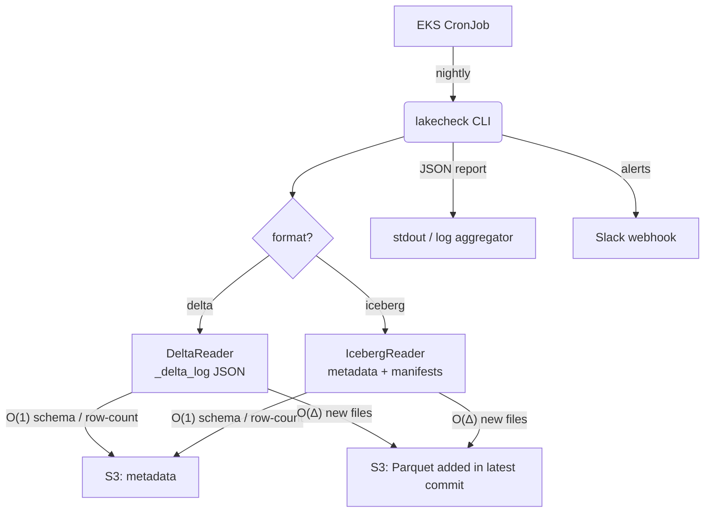

# lakehouse-checker (`lakecheck`)

[](https://www.python.org/)
[](https://delta-io.github.io/delta-rs/)
[](https://py.iceberg.apache.org/)
[](#why-lakecheck)
[](LICENSE)

A lightweight, **zero-JVM** command-line tool for detecting silent data
corruption in **Delta Lake *and* Apache Iceberg** tables — duplicate primary
keys, schema drift, dropped columns, and null spikes — without full-table scans
and without Spark.

## Why lakecheck?

Data pipelines occasionally write bad data. Catching it usually means a
heavyweight observability framework that runs **full-table Spark scans**, racking
up compute. `lakecheck` is a Unix-philosophy tool that runs as a cheap
Kubernetes CronJob and leans on each format's own metadata to bound compute
to two tight complexity classes:

| Bound    | Checks                        | How it works                                        | Compute            |
| -------- | ----------------------------- | --------------------------------------------------- | ------------------ |
| **O(1)** | Schema drift, row-count drops | Reads transaction-log / table metadata JSON         | Metadata only      |
| **O(Δ)** | Null spikes, duplicate PKs    | Scans **only** the files *added* by the latest commit | PyArrow, new files only |

**One tool, two formats, no JVM.** Delta metadata is read directly from the
`_delta_log` (delta-rs), Iceberg from `metadata.json` + manifest snapshots
(PyIceberg), and the O(Δ) data scans use PyArrow. There is no Spark and no Java
anywhere — the container needs no JRE and starts instantly.

## Formats & auto-detection

`lakecheck` detects the format from the table layout, or you can be explicit:

- `_delta_log/` present → **Delta**
- `metadata/` with `*.metadata.json` → **Iceberg**
- `--format delta|iceberg` to skip detection

For Iceberg, "version N" means the **N-th snapshot** in chronological order, so
version N vs N-1 compares consecutive snapshots — the same semantics as Delta
commit versions.

## Architecture



### How it works

1. **Version discovery — O(1):** Delta lists `_delta_log/*.json` for the max
   version; Iceberg counts snapshots. No data read.
2. **Schema drift — O(1):** Compare the active schema at version N vs N−1 from
   metadata (Delta `schemaString`, Iceberg schema-by-id).
3. **Row-count drop — O(1):** Compare rows *added* per commit from stats
   (Delta `add.stats.numRecords`, Iceberg snapshot `added-records`).
4. **Null spikes — O(Δ):** Read **only** the Parquet files added in the latest
   commit into PyArrow; compute null % per column.
5. **Duplicate PKs — O(Δ):** Group **only** the latest-commit files by the PK
   column(s) with PyArrow and count groups with > 1 row.

## Installation

```bash
pip install lakecheck        # (from source below until published)
```

From source (editable, with dev tools):

```bash
pip install -e ".[dev]"      # installs pytest, ruff, and the `lakecheck` CLI
```

## Usage

```bash
# Delta (auto-detected)
lakecheck s3://my-bucket/tables/users \
  --pk user_id \
  --check-nulls email,status \
  --slack-webhook https://hooks.slack.com/services/...

# Iceberg (explicit)
lakecheck s3://my-bucket/warehouse/db/events --format iceberg --pk event_id
```

### CLI reference

| Flag                          | Description                                                          |
| ----------------------------- | -------------------------------------------------------------------- |
| `table_path` *(positional)*   | Path to the table (`s3://` / `s3a://` / local).                      |
| `--format delta\|iceberg`     | Table format. Auto-detected from layout when omitted.                |
| `--version N`                 | Target commit/snapshot version. Defaults to the latest.              |
| `--pk col1,col2`              | Primary key column(s) — enables the O(Δ) duplicate-PK check.         |
| `--check-nulls c1,c2`         | Columns to check for null spikes (O(Δ) scan of new files).           |
| `--json`                      | Emit machine-readable JSON instead of the terminal report.           |
| `--slack-webhook`             | Slack incoming-webhook URL. Fires **only** when anomalies exist.     |

### Sample terminal output

```
$ lakecheck s3://my-bucket/users --pk id --check-nulls email

lakecheck Report [delta] for s3://my-bucket/users (Version 42)
============================================================
✔ No Schema Drift
✖ Row Count Drop Detected (-80.00%)
✖ Null Spike in 'email' (100.0% vs 0.0%)
✖ Duplicate PKs Detected (1 duplicates)
============================================================
```

### Sample JSON output

```json
{
  "table_path": "/path/to/table",
  "version": 1,
  "schema_diff": {"added_columns": [], "removed_columns": [], "type_changes": {}},
  "row_count_diff": {"version_n_added_rows": 2, "version_n_minus_1_added_rows": 10, "percentage_change": -80.0, "exceeds_threshold": true},
  "null_spikes": [{"column": "email", "version_n_null_pct": 100.0, "version_n_minus_1_null_pct": 0.0, "spike_detected": true}],
  "duplicate_pks": {"has_duplicates": true, "duplicate_count": 1},
  "format": "delta",
  "has_anomalies": true
}
```

### Exit codes

| Code | Meaning                          |
| ---- | -------------------------------- |
| `0`  | No anomalies detected.           |
| `1`  | One or more anomalies detected.  |

## Configuration & environment

| Setting                  | Default    | Notes                                            |
| ------------------------ | ---------- | ------------------------------------------------ |
| Row-count-drop threshold | `-10 %`    | Tune in `check_row_count_drop`.                  |
| Null-spike sensitivity   | `+10` pts  | Tune in `check_null_spikes`.                     |
| S3 credentials           | `AWS_*` env| `AWS_ENDPOINT_URL` / `AWS_ACCESS_KEY_ID` / `AWS_SECRET_ACCESS_KEY` / `AWS_REGION` (IRSA on EKS). |

## Deployment

Production assets live in [`infra/`](infra):

- **Terraform** (`infra/terraform/`): strictly-scoped IRSA role granting only
  `s3:GetObject` + `s3:ListBucket` on the configured table paths.
- **Kubernetes** (`infra/k8s/lakecheck-cronjob.yaml`): a nightly CronJob. Because
  the tool is zero-JVM, it requests only **256Mi / 250m** (vs the GB-scale a
  Spark checker would need).

Build & run the multi-stage, non-root image (no JRE):

```bash
docker build -t lakecheck:latest .
docker run --rm -v "$PWD:/data" lakecheck:latest /data/my_table --pk id --json
```

## Testing

20 tests, all zero-JVM (Delta via delta-rs, Iceberg via PyIceberg):

```bash
ruff format --check .   # style
ruff check .            # lint + security
pytest -v tests/        # Delta + Iceberg engine, storage, reporters, CLI
python3 scripts/smoke_test.py   # E2E CLI over real Delta + Iceberg tables
```

See [**TESTING.md**](TESTING.md) for details.

## Contributing

We follow a strict "Ponytail Convention" — lazy, efficient engineering (see
[`CONTRIBUTING.md`](CONTRIBUTING.md)). In short: prefer **O(1)/O(Δ)** over full
scans, reach for the standard library / PyArrow before a heavy dependency, and
fix root causes rather than scattering guards.

## License

MIT — see [`LICENSE`](LICENSE).
